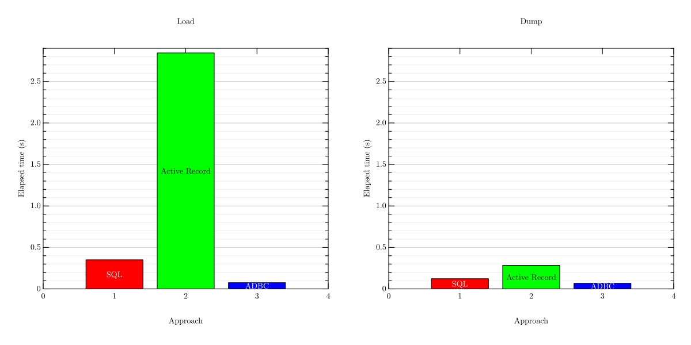

# Active Record ADBC adapter

## Description

Active Record ADBC adapter provides an
[ADBC](https://arrow.apache.org/adbc/) adapter for Active Record.

This adapter is optimized for extracting and loading large data
from/to DBs. The optimization is powered by Apache Arrow.

## Install

### `Gemfile`

Add
[rubygems-requirements-system](https://rubygems.org/gems/rubygems-requirements-system)
plugin and activerecord-adbc-adapter gem to your `Gemfile`:

```ruby
plugin "rubygems-requirements-system"

gem "activerecord-adbc-adapter"
```

This adapter requires ADBC libraries implemented in C++. The
rubygems-requirements-system plugin installs it into your system
automatically.

### GitHub Actions

On GitHub Actions, you should not use the [`bundler-cache:
true`](https://github.com/ruby/setup-ruby?tab=readme-ov-file#caching-bundle-install-automatically)
option. Because it only caches activerecord-adbc-adapter gem. It
doesn't cache ADBC libraries installed into your system. You need to
run `bundle install` after `actions/setup-ruby` something like the
following:

```yaml
- uses: ruby/setup-ruby@v1
  with:
    ruby-version: ruby
    # bundler-cache: true # No "bundler-cache: true"
- run: bundle install
```

### ADBC driver

You also need to install ADBC drivers for systems you want to
connect. For example, you need the ADBC driver for PostgreSQL when you
want to connect to PostgreSQL.

See https://arrow.apache.org/adbc/current/driver/installation.html for
the latest information.

Here is information for some drivers:

PostgreSQL:

```bash
# Debian/Ubuntu
sudo apt install libadbc-driver-postgresql-dev
```

```bash
# Red Hat Enterprise Linux variants
sudo dnf install adbc-driver-postgresql-devel
```

SQLite:

```bash
# Debian/Ubuntu
sudo apt install libadbc-driver-sqlite-dev
```

```bash
# Red Hat Enterprise Linux variants
sudo dnf install adbc-driver-sqlite-devel
```

DuckDB: You don't need to install additional packages for ADBC
support. `libduckdb.so` includes ADBC support.

## Usage

This adapter is optimized for extracting and loading large data
from/to DBs. You should use the built-in adapters for normal CRUD use
cases. You should use this adapter only for large data.

You can use the Active Record's [multiple databases
support](https://guides.rubyonrails.org/active_record_multiple_databases.html)
feature.

### `config/database.yml`

Here is a sample `config/database.yml`. The `primary` configuration is
for the built-in PostgreSQL adapter. The `adbc` configuration is for
this adapter.

```yaml
default: &default
  primary:
    adapter: postgresql
    encoding: unicode
    pool: <%= ENV.fetch("RAILS_MAX_THREADS") { 5 } %>
    url: <%= ENV.fetch("DATABASE_URL") { "postgresql:///my_app_#{Rails.env}" } %>
  adbc:
    adapter: adbc
    driver: adbc_driver_postgresql
    # "uri" not "url"!!!
    uri: <%= ENV.fetch("DATABASE_URL") { "postgresql:///my_app_#{Rails.env}" } %>
    # You need this to avoid migration.
    database_tasks: false
development:
  <<: *default
test:
  <<: *default
production:
  <<: *default
```

> [!NOTE]
>
> Configuration parameters are different for each ADBC driver. For
> example, [the PostgreSQL
> driver](https://arrow.apache.org/adbc/current/driver/postgresql.html)
> and [the SQLite
> driver(https://arrow.apache.org/adbc/current/driver/sqlite.html) use
> `uri` for connection information but [the DuckDB
> driver](https://duckdb.org/docs/stable/clients/adbc.html) uses
> `entrypoint` and `path`:
>
> ```yaml
> adbc:
>   adapter: adbc
>   driver: duckdb
>   entrypoint: duckdb_adbc_init # You should not change this.
>   path: <%= ENV.fetch("DATABASE_PATH") { Rails.root.join("db", "#{Rails.env}.duckdb") } %>
>   # You need this to avoid migration.
>   database_tasks: false
> ```
>
> See the driver's documentation for available parameters.

### Model

You need to create an abstract class for the ADBC connection:

```ruby
# app/models/adbc_application_record.rb
class AdbcApplicationRecord < ActiveRecord::Base
  include ActiveRecordADBCAdapter::Ingest

  self.abstract_class = true
  connects_to database: { writing: :adbc, reading: :adbc }
end
```

You can create a model for the ADBC connection:

```ruby
# app/models/adbc_event.rb
class AdbcEvent < AdbcApplicationRecord
  self.table_name = :events
end
```

You can use `Event` (that is derived from `ApplicationRecord` not
`AdbcApplicationRecord`) model for normal use case and `AdbcEvent` for
large data use case. For the large data use case, you should use
Apache Arrow data as-is as much as possible for performance. You can
get Apache Arrow data by `#to_arrow`:

```ruby
AdbcEvent.all.to_arrow
```

You can use `.ingest` to load Apache Arrow data:

```ruby
AdbcEvent.ingest(arrow_data)
```

You can copy large data efficiently by these method. Here is an sample
code to copy events in the latest 30 days to DuckDB from PostgreSQL:

```ruby
DuckDBAdbcEvent.ingest(PgAdbcEvent.where(created_at: ..(1.month.ago)).to_arrow)
```

## Performance

Here is a benchmark result with 100 integer columns and 10000 rows
load/dump with PostgreSQL. This adapter is faster than Active Record's
built-in PostgreSQL adapter and raw SQL (`INSERT INTO ...` and
`SELECT * FROM ...`).

Load:

```text
                   user     system      total        real
SQL            0.003738   0.003141   0.006879 (  0.350767)
Active Record  2.423670   0.047003   2.470673 (  2.844029)
ADBC           0.010229   0.010960   0.021189 (  0.075787)
```

Dump:

```text
                   user     system      total        real
SQL            0.110934   0.006219   0.117153 (  0.123201)
Active Record  0.271154   0.008948   0.280102 (  0.283621)
ADBC           0.026966   0.006945   0.033911 (  0.067801)
```




See [`benchmark/`](benchmark/) for details.

## License

The MIT license. See `LICENSE.txt` for details.
